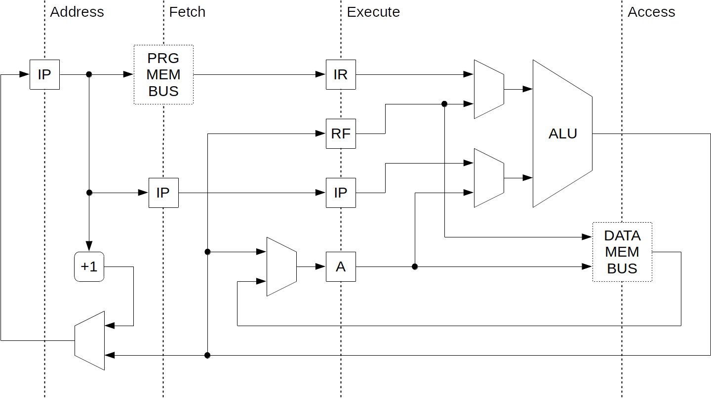

# Tine Alpha

Tine Alpha is an 8-bit MISC (Minimal Instruction Set Computer) processor architecture with a 4-stage pipelining. Initiated in 2016 as a prototype processor with pipelining for the [Limen processor series](https://github.com/dominiksalvet/limen). It has the following significant properties:

* Harvard memory architecture
* May address up to 256 B of each instructions and data
* Accumulator-based design
* Conditional skip instructions

## Machine Code

If you are curious how the machine code of Tine Alpha looks like, browse the [collection of such programs](sw).

## Original Plan

The original intention was to design and release also the following Tine processors.

### Tine Beta

* Remake to five-stage pipelining
* Optimized critical paths
* Cache included

### Tine Gamma

* Asynchronous implementation of Tine Beta

## Useful Resources

* [support.md](support.md) – questions, answers, help
* [contributing.md](contributing.md) – how to get involve
* [license](license) – author and license
